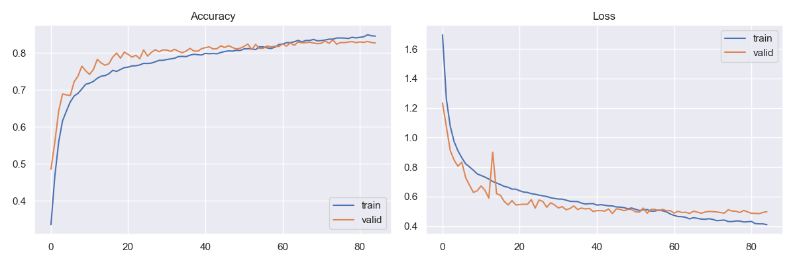
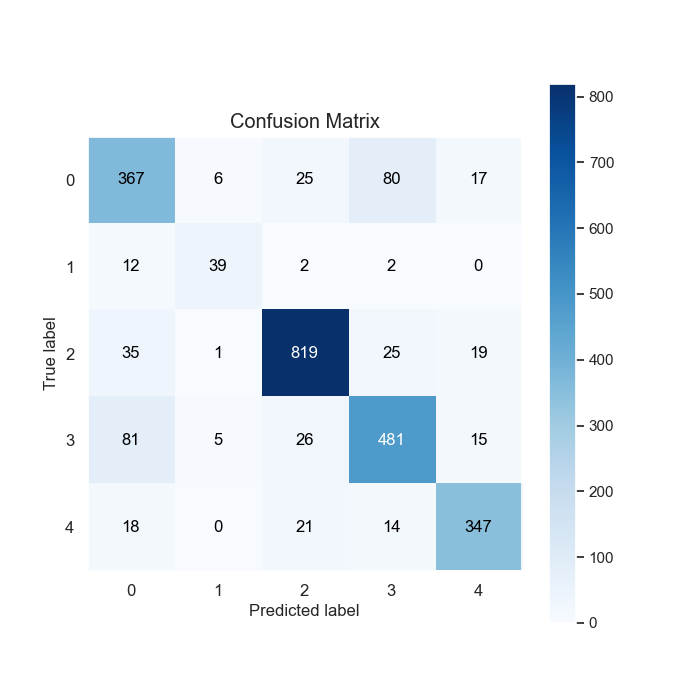
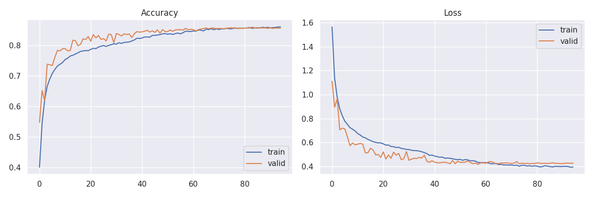
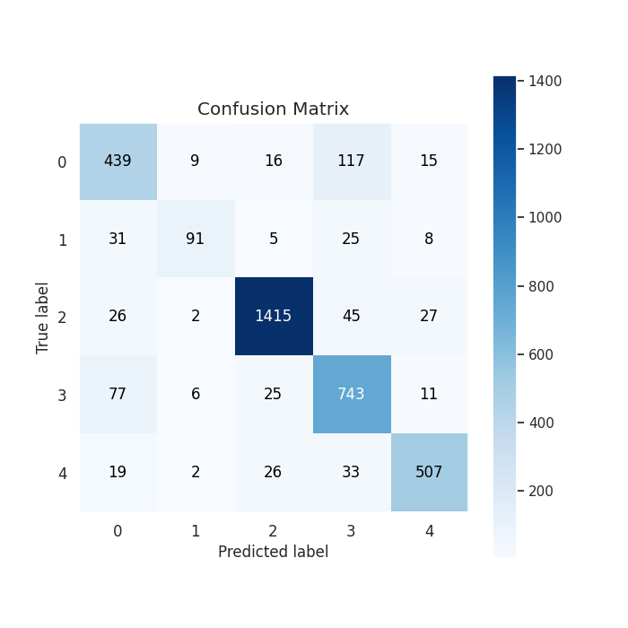
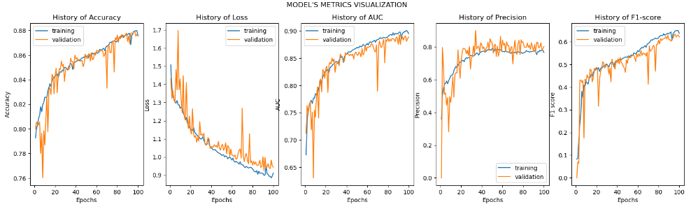
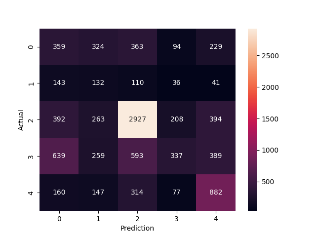
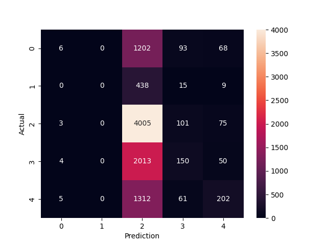
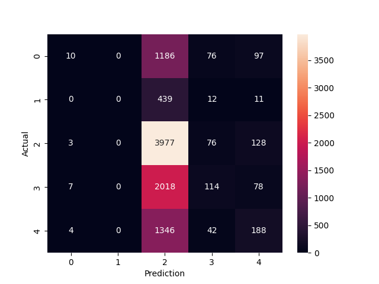
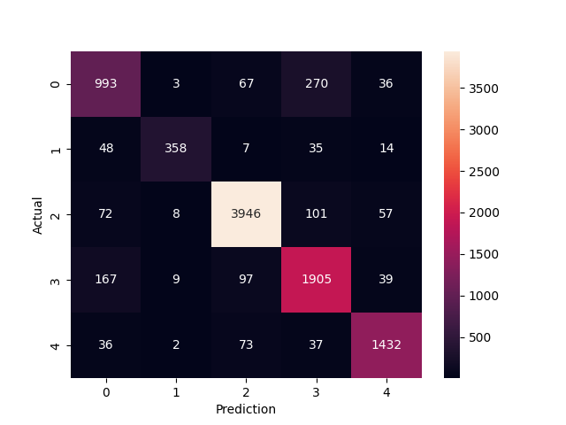

# CXE Documentation

## Table of contents

- [CXE Documentation](#cxe-documentation)
  - [Table of contents](#table-of-contents)
- [About](#about)
- [FER models](#fer-models)
  - [Available models for emotion detection](#available-models-for-emotion-detection)
  - [FER](#fer)
  - [VGG16](#vgg16)
  - [FERS](#fers)
  - [Vision Transformers](#vision-transformers)
    - [ViT](#vit)
    - [BeIT](#beit)
    - [convNext](#convnext)
  - [Datasets](#datasets)
    - [AffectNet](#affectnet)
    - [FER2013](#fer2013)
    - [CK+](#ck+)
    - [RAF](#raf)

- [App](#app)
  - [Deploying Emotion Detection Model](#deploying-emotion-detection-model)
  - [Deployment Process Overview](#deployment-process-overview)
  - [Frontend](#frontend)
  - [Backend](#backend)
  - [Stable Diffusion](#stable-diffusion)
  - [Deployment of Web Application](#deployment-of-web-application)
- [Segmentation](#segmentation)
  - [Introduction to image segmentation](#introduction-to-image-segmentation)
  - [Emotion evoking in photos](#emotion-evoking-in-photos)
  - [Methods of image segmentation](#methods-of-image-segmentation)
      - [Edge-based segmentation](#edge-based-segmentation)
      - [Region-based segmentation](#region-based-segmentation)
      - [Contour-based segmentation](#contour-based-segmentation)
      - [Threshold segmentation](#threshhold-segmentation)
      - [Deep learning-based segmentation](#Deep-learning-segmentation)
  - [Dataset](#dataset)
  - [Deeplabv3Plus](#deeplabv3plus)
      - [Introduction](#introduction)
      - [Dataset](#dataset-training)
      - [Results](#results)
  - [Final segmentation](#final-segmentation)
  - [Stable diffision](#stable-diffiusion)
      - [Introduction](#introduction-to-stable-diffiusion)
      - [Training Dataset](#training-dataset)
      - [Training and results](#training-and-results)
- [Eye tracking](#eye-tracking)
  - [Introduction to eye-tracking](#introduction-to-eye-tracking)
  - [How to measure the accuracy of eye-trackers](#how-to-measure-the-accuracy-of-eye-trackers)
  - [Our solution - tobii eye tracker 5](#our-solution---tobii-eye-tracker-5)
  - [Specification for eye tracker 5](#specification-for-eye-tracker-5)
  - [Talon description](#talon-description)
  - [Merge with backend](#merge-with-backend)
  - [Summary](#summary)
- [Biosignals](#biosignals)
  - [Introduction to biosignals](#introduction-to-biosignals)
  - [Aidmed](#aidmed)
  - [Approach](#approach)
- [Examination](#examination)
  - [Flow](#flow)
  - [Example](#example)

## About
This file contains description about CxE Tool.

## FER models

## Available models for emotion detection:
  

### FER

  

Model: 
Encoding:  
0  -> Anger  
1  -> Disgust  
2  -> Happy  
3  -> Sad  
4  -> Surprised  

It is created on Convolutional Neural Network (CNN) and it is feeded by batches of 48x48x1 gray-scaled images, which are next stacked along the 4th dimension, as it uses mini-batch gradient descent as optimizer (Adam).

CNN setting we used:

- For generalization purpose dropouts are used at regular intervals.

- ELU is used as the activation function.

- He_normal is used as a kernel initializer.

- Batch min-max normalization is used for better results.

Results:

- First model trained on FER2013 dataset:

Values of Accuracy and Loss, on the training and validation datasets respectively:
 

The confusion matrix of predictions produced by our model:

- Second model trained on FER2013, CK+ and custom dataset:

Values of Accuracy and Loss, on the training and validation datasets respectively:
 

The confusion matrix of predictions produced by our model: 

 

### VGG16

Model:

The VGG16 model for facial emotion detection consists of a deep neural network architecture. It starts with a pre-trained base model, which is then followed by several layers to fine-tune the model for emotion recognition.
The model begins with a Dropout layer, which helps in preventing overfitting by randomly dropping out a fraction of the input units. Next, a Flatten layer is added to convert the multi-dimensional output into a 1D vector.
To normalize the inputs and stabilize the learning process, a BatchNormalization layer is included. It standardizes the inputs by adjusting and scaling the activations.
Following that, there are three Dense layers with 32 neurons each, initialized with the 'he_uniform' method. Each Dense layer is followed by a BatchNormalization layer and an Activation layer with the ReLU activation function. 
To further prevent overfitting, Dropout layers with a dropout rate of 0.5 are added after each Dense layer. These layers randomly ignore a fraction of the neurons during training, promoting better generalization.
Finally, the model ends with a Dense layer with 5 neurons, representing the 5 emotions to be detected (happiness, sadness, anger, surprise, disgust). The activation function used in this layer is softmax, which normalizes the output into a probability distribution, indicating the predicted emotion.

Results:

- First model trained on FER2013, CK+ and custom dataset:

Model metric visualisation:
    

### FERS
FERSNet (Facial Emotion Recognition and Synthesis Network) is a state of the art model for emotion recognition. The model is multi-modal, it has two inputs (face image and a target emotion) and outputs (prediction and face with a synthesized emotion). It utilizes multi-task learning to achieve very high accuracy. The network simultaneously performs classification and synthesis of a face with a different emotion than the one on input. The network can be used not only to perform classification, but also balance the number of photos in each class in the dataset.  
Results of the training on the merged dataset:
 
| Class      | Precision            | Recall              | F1-Score            | Support |
| ------------ | -------------------- | ------------------- | -------------------- | ------- |
| 0            | 0.21204961606615474    |0.26223520818115414   | 0.23448726322664923   | 1369    |
| 1            | 0.11733333333333333 | 0.2857142857142857 | 0.16635160680529298 | 462     |
| 2            | 0.6795913628976086    | 0.6995697896749522   | 0.6894358732775882   | 4184    |
| 3            | 0.44813829787234044    | 0.15200721695985567    | 0.22701246210845405   | 2217    |
| 4            | 0.4558139534883721  | 0.5582278481012658   | 0.5018492176386913   | 1580    |
| Accuracy     | 0.4725845902975948    | 0.4725845902975948   | 0.4725845902975948   | 0.444659600489197 |
| Macro Avg    | 0.3825853127315618    | 0.3915508697263027   | 0.3638272846113351   | 9812    |
| Weighted Avg | 0.499553897233262    | 0.4725845902975948   | 0.4666403986810367   | 9812    |
 
    

### Vision Transformers
Vision Transformers, also known as ViTs, are a revolutionary breakthrough in the field of computer vision. They apply the transformer model, originally designed for natural language processing tasks, to image analysis, disrupting the previously convolutional neural network (CNN) dominated landscape. ViTs offer a promising new paradigm for interpreting and processing visual data.

The principal idea behind ViTs is treating an image as a sequence of patches, similar to treating a sentence as a sequence of words or tokens in text-based transformers. Each image is split into a set of fixed-size patches, which are then linearly embedded and processed through a sequence of transformer layers.

This allows the model to handle varying resolutions and learn to focus on the most informative parts of the image, similar to how attention mechanisms in transformers allow the model to focus on the most relevant parts of a sentence. Additionally, the global receptive field of transformers allows for long-range pixel dependencies to be modeled, which is a key advantage over CNNs.

Vision Transformers have shown impressive performance on a range of tasks including image classification, object detection, and semantic segmentation, often outperforming their CNN counterparts. 

Encoding for models: 
0  -> Anger  
1  -> Disgust  
2  -> Happy  
3  -> Sad  
4  -> Surprised  

### ViT
The Vision Transformer (ViT) model was proposed in An Image is Worth 16x16 Words: Transformers for Image Recognition at Scale by Alexey Dosovitskiy, Lucas Beyer, Alexander Kolesnikov, Dirk Weissenborn, Xiaohua Zhai, Thomas Unterthiner, Mostafa Dehghani, Matthias Minderer, Georg Heigold, Sylvain Gelly, Jakob Uszkoreit, Neil Houlsby. It’s the first paper that successfully trains a Transformer encoder on ImageNet, attaining very good results compared to familiar convolutional architectures.

Results:  

| Class      | Precision            | Recall              | F1-Score            | Support |
| ------------ | -------------------- | ------------------- | -------------------- | ------- |
| 0            | 0.333333333333333    | 0.004382761139518   | 0.008651766402307   | 1369    |
| 1            | 0                    | 0                   | 0                   | 462     |
| 2            | 0.446488294314381    | 0.957217973231358   | 0.608940246312909   | 4184    |
| 3            | 0.357142857142857    | 0.06765899864682    | 0.113765642775882   | 2217    |
| 4            | 0.5                  | 0.127848101265823   | 0.203629032258064   | 1580    |
| Accuracy     | 0.444659600489197    | 0.444659600489197   | 0.444659600489197   | 0.444659600489197 |
| Macro Avg    | 0.327392896958114    | 0.231421566856704   | 0.186997337549832   | 9812    |
| Weighted Avg | 0.398107019061396    | 0.444659600489197   | 0.319364304910298   | 9812    |
 

Confusion Matrix:

### BeIT
(BERT pre-training of Image Transformers) by Microsoft Research. BEiT models outperform supervised pre-trained vision transformers using a self-supervised method inspired by BERT (masked image modeling) and based on a VQ-VAE.

Results:  
| Class       | Precision            | Recall              | F1-Score            | Support |
| ------------ | -------------------- | ------------------- | -------------------- | ------- |
| 0            | 0.416666666666667    | 0.007304601899197   | 0.014357501794688   | 1369    |
| 1            | 0                    | 0                   | 0                   | 462     |
| 2            | 0.443564577291992    | 0.950525812619503   | 0.604866920152091   | 4184    |
| 3            | 0.35625              | 0.051420838971583   | 0.089869925108396   | 2217    |
| 4            | 0.374501992031872    | 0.118987341772152   | 0.18059558117195    | 1580    |
| Accuracy     | 0.437117814920506    | 0.437117814920506   | 0.437117814920506   | 0.437117814920506 |
| Macro Avg    | 0.318196647198106    | 0.225647719052487   | 0.177937985645425   | 9812    |
| Weighted Avg | 0.388076870716135    | 0.437117814920506   | 0.309315252353269   | 9812    |
 

Confusion Matrix:

### convNext
The ConvNeXT model was proposed in A ConvNet for the 2020s by Zhuang Liu, Hanzi Mao, Chao-Yuan Wu, Christoph Feichtenhofer, Trevor Darrell, Saining Xie. ConvNeXT is a pure convolutional model (ConvNet), inspired by the design of Vision Transformers, that claims to outperform them.

Results:  
| Class       | Precision            | Recall              | F1-Score            | Support |
| ------------ | -------------------- | ------------------- | -------------------- | ------- |
| 0            | 0.754559270516717    | 0.725346968590212   | 0.739664804469274   | 1369    |
| 1            | 0.942105263157895    | 0.774891774891775   | 0.850356294536817   | 462     |
| 2            | 0.941766109785203    | 0.943116634799235   | 0.942440888464294   | 4184    |
| 3            | 0.811328790459966    | 0.859269282814614   | 0.834611171960569   | 2217    |
| 4            | 0.907477820025348    | 0.906329113924051   | 0.906903103229892   | 1580    |
| Accuracy     | 0.879942927028129    | 0.879942927028129   | 0.879942927028129   | 0.879942927028129 |
| Macro Avg    | 0.871447450789026    | 0.841790755003977   | 0.854795252532169   | 9812    |
| Weighted Avg | 0.880669033871527    | 0.879942927028129   | 0.879726689163154   | 9812    |
 

Confusion Matrix:

### Summary of transformers

As we can see, convNext outperform other models as the authors have said. It is also possible that if we tune beit and vit more carefully, we will achieve better results. Besides that, convNext achieve promising results. Models were tested on the merged dataset FER2013 + CK+.

## Datasets:

### AffectNet

AffecNet is a facial emotion recognition dataset first published in 2017 that introduced a new scale for emotion recognition. Instead of a categorical model where each emotion is considered as a discrete state, it uses a different scale, namely Valence and Arousal. This dataset however is unavaible at the moment. We tried contacting the original authors of the dataset but were not able to get a response at the time.

### FER2013

The data consists of 48x48 pixel grayscale images of faces. The faces have been automatically registered so that the face is more or less centered and occupies about the same amount of space in each image. The training set consists of 28,709 examples and the public test set consists of 3,589 examples, divided into seven categories:

- Angry

- Disgust

- Fear

- Happy

- Sad

- Surprise

- Neutral

### CK+

Cohn-Kanade Dataset (CK+) that contains 920 individual facial expressions.

Data is already reshaped to 48x48 pixels, in grayscale format and facecropped using haarcascade_frontalface_default.

Noisy (based on room light/hair format/skin colour) images were adapted to be clearly identified using Haar classifier.

Labelled with one of seven expression classes:

 - Anger

 - Contempt 

 - Disgust 

 - Fear 

 - Happiness 

 - Sadness 

 - Surprise. 
 
### RAF

The Real-world Affective Faces Database (RAF-DB) is a dataset for facial expression. It contains 29672 facial images tagged with basic or compound expressions by 40 independent taggers. Images in this database are of great variability in subjects' age, gender and ethnicity, head poses, lighting conditions, occlusions, (e.g. glasses, facial hair or self-occlusion), post-processing operations (e.g. various filters and special effects), etc.

## App
## Deploying Emotion Detection Model

## Introduction
Emotion detection models are powerful tools that can analyze and interpret human emotions based on various sources, such as images or videos. Integrating such a model in the backend of an application can enhance its functionality and performance.

The deployed emotion detection model is based on TensorFlow.js, a JavaScript library that enables the creation and deployment of machine learning models in the browser or Node.js environment. The model is loaded from an H5 format and used to analyze frames received from the frontend as Base64-encoded data.

## Technologies Used in the Project

- TensorFlow.js: A JavaScript library for creating and deploying machine learning models. Used to load the emotion model from the H5 format.

- Node.js: A JavaScript runtime environment that enables the creation of the application backend.

- Sharp: A Node.js module used for image data transformation and scaling.

- @vladmandic/face-api: A JavaScript library for face detection in images.

## Deployment Process Overview

### Environment Setup
Before starting the deployment process, ensure that you have the following tools installed:

- Node.js: Install Node.js from the official documentation website, following the instructions provided.
- TensorFlow.js: Install TensorFlow.js using npm or yarn package manager:

npm install @tensorflow/tfjs

- Sharp: Install the Sharp module using npm or yarn:

npm install sharp

- @vladmandic/face-api: Install the @vladmandic/face-api library using npm or yarn:

npm install @vladmandic/face-api

### Back-end functionality

The backend of the application is responsible for receiving requests from the frontend, which contain image frames in base64 format. Using the Sharp module, the backend processes these frames by performing various operations such as scaling, cropping, or adjusting colors. Then, the transformed frames are converted into tensors, which are data structures used by TensorFlow.js. These tensors are inputted into the model handled by TensorFlow.js. This model can be trained for various tasks, such as object recognition or image content analysis. After processing by the model, the results are sent back to the frontend as a response to the initial request.

### Frontend functionality

A part of the frontend of the application consists of several important components. Firstly, the frontend captures frames from the camera, enabling real-time image capturing. Then, using the @vladmandic/face-api library, the frontend performs face detection on the captured frames and crops them to preserve only the facial area. The cropped images are then converted to the base64 format to facilitate processing and transmission. For this purpose, the frontend sends a request to the backend containing the processed images in base64 format. Upon receiving a response from the backend, the frontend collects feedback information related to the emotions associated with the processed faces. The frontend gathers several emotion records related to a specific triggering image. Once a sufficient number of records are accumulated, the frontend sends them to a MongoDB database for storage and analysis

## Conclusion
Deploying an emotion detection model involves several steps, such as converting Base64-encoded image data to tensors, scaling the image, performing predictions on the model, and passing the results back to the frontend. The key technologies used in this project are TensorFlow.js, Node.js, Sharp, and @vladmandic/face-api. By following these guidelines, you should be able to deploy an emotion detection model in your application.

# Frontend

## Introduction

Frontend development is essential for creating a user-friendly and interactive experience in our application. It involves designing and implementing the user interface using HTML, CSS, and JavaScript. With modern frameworks like React, we can build modular and reusable components. In our app, the frontend handles tasks such as capturing camera frames, face detection, image preprocessing, and communicating with the backend. By following best practices in frontend development, we ensure a smooth user experience across devices. This documentation covers the frontend implementation, including component structure, integration with backend APIs, user interaction handling, and visual elements. Understanding the frontend architecture and technologies used will enable you to enhance and troubleshoot the frontend components effectively. Let's explore the frontend development of our app, empowering users with an immersive and intuitive experience.

## Technologies Used in Frontend

- HTML5: A markup language used for structuring and presenting content on the web.

- CSS3: A style sheet language used for describing the presentation of a document written in HTML.

- JavaScript: A programming language that enables dynamic behavior and interactivity on web pages.

- React: A JavaScript library for building user interfaces, enabling the creation of reusable UI components and managing application state.

- Fetch API: A modern JavaScript API for making asynchronous HTTP requests.

## Frontend Structure

### Component Organization:

Each major section or feature of the application has its own dedicated component. Components are organized in a logical directory structure, with related components grouped together. Commonly used components, such as Footer and Navbar, are placed in separate directories for easy reusability across multiple sections of the application.

### Component Reusability:

Components like Footer and Navbar are imported and used in multiple sections, ensuring consistency and promoting code reuse. Reusability is achieved by keeping components independent and decoupled from specific data or functionalities.

### Styling:

Styling is managed using CSS files specific to each component or section. Each component's CSS file is imported within the component, allowing for modular and scoped styles. CSS classes and selectors are used to target and style specific elements within the components.

### Routing:

Routing is used to navigate between different pages or sections of the application. In our application it is implemented by using a React Router library.

### Event Handling and State Management:

React's useState hook is used to manage component-level state. Event handling functions are defined within the components and triggered by user interactions, such as button clicks or input changes. State changes are captured and reflected in the UI, enabling dynamic behavior and interactivity.

## Frontend Functionality in Emotion Detection

The frontend retrieves the user's email from the browser's local storage to authenticate the user and determine their identity. The frontend renders an image slider component, which displays a series of images. It captures frames from the user's camera using the getUserMedia API provided by modern web browsers. Using the captured frames, the frontend performs face detection by sending the frames to the backend using Axios. The backend utilizes an emotion detection model to analyze the detected faces and predict emotions. The results, such as the detected emotions and timestamps, are stored in the frontend's state. The frontend displays the emotion-related information to the user. It renders the current image from the slider and adjusts its visibility based on the slider's active state. The frontend provides button to start the image slider. When the slider is started, the frontend enters fullscreen mode and begins capturing frames from the camera. After a predefined duration, the frontend redirects the user to the "end_test" page. This action signifies the completion of the emotion detection test.

## Frontend Functionality in AI image Generator

The frontend renders a form where users can select the style of image generation by choosing an emotion from a set of radio buttons. Users can also enter a prompt text in an input field, which will be used as a basis for generating the image. As users enter or modify the prompt text, the frontend updates the internal state (promptText) to reflect the changes. When the "Generate image" button is clicked, the frontend retrieves the selected emotion from the radio buttons. It constructs a modified prompt text by prefixing the emotion to the original prompt text. The frontend then sends a POST request to the backend using the Fetch API, providing the modified prompt text and emotion prefix as the request payload. Upon receiving a response from the backend, the frontend checks if the response is successful. If successful, it extracts the generated image URL from the response data and updates the internal state (generatedImage) to store the image URL. The frontend renders the generated image in an img element if an image URL exists in the generatedImage state. This allows users to visualize the image they generated based on the selected emotion and prompt.

## Conclusion

The frontend development in our application plays a crucial role in creating a user-friendly and interactive experience. By utilizing technologies such as HTML5, CSS3, JavaScript, React, and the Fetch API, we are able to design and implement a modular and reusable frontend architecture. The frontend structure follows a component-based organization, where each major section or feature of the application has its own dedicated component. This promotes code reusability, maintainability, and scalability. Styling is managed using CSS files specific to each component, allowing for modular and scoped styles. By following best practices and leveraging the power of frontend technologies, we can deliver an immersive and intuitive experience to our users.

# Backend

## Introduction
The backend is the component of our application that handles the server-side logic and communication with the database. It provides the necessary APIs for the frontend to interact with and retrieve or store data. This documentation covers the backend implementation, including server setup, database connection, API routes, and data processing. The backend architecture follows a RESTful design pattern, allowing for standardized and predictable API endpoints. It employs the power of Node.js and Express.js to handle concurrent requests efficiently, ensuring optimal performance and responsiveness.

## Technologies Used in the Backend
- Node.js: A JavaScript runtime that allows us to execute JavaScript code on the server-side.

- Express.js: A web application framework for Node.js that simplifies the creation of robust APIs.

- MongoDB: A NoSQL database used to store and retrieve data in a flexible, scalable, and schema-less manner.

- Mongoose: An Object Data Modeling (ODM) library for Node.js and MongoDB, providing a higher-level abstraction for database operations.

## Backend Structure
Server Setup:
The backend server is set up using Express.js. The index.js file is the entry point of the backend application. It imports required dependencies such as Express, bodyParser, and cors. It also imports the necessary configuration settings from the config.js file. The server is then initialized using app.listen() with the specified port from the configuration.

### Database Connection:
The backend connects to the MongoDB database using Mongoose. The connection configuration is defined in the db/mongoose.js file. It uses the Mongoose connect() method to establish a connection to the MongoDB server. Upon successful connection, Mongoose emits a connected event.

### API Routes:
The backend defines several API routes to handle different types of requests from the frontend. These routes are defined in separate files within the routes directory.

- `user.routes.js`: Defines routes related to user authentication and user data.

- `model.routes.js`: Defines routes for interacting with the model used for emotion detection.

- `emotions.routes.js`: Defines routes for handling emotion detection data.

- `stable.routes.js`: Defines routes for Stable Diffusion access.

These route files utilize the Express Router to define the API endpoints and specify the corresponding controller functions to handle the requests.

### Request Parsing and CORS:
The backend uses the body-parser middleware to parse incoming request bodies in JSON format. It is applied using the app.use() method with bodyParser.json().

CORS (Cross-Origin Resource Sharing) is enabled in the backend using the cors middleware. It allows the frontend to make requests to the backend API from a different origin.

### Default Route:
The backend defines a default route (/) that responds with a simple success message when accessed via a GET request.

## Backend Functionality

- User Routes:
The user routes handle user authentication and user-related data. They include endpoints for user registration, login, and profile retrieval. These routes interact with the database using the Mongoose models and perform necessary operations like user creation, authentication, and data retrieval.

- Model Routes:
The model routes are responsible for interacting with the emotion detection model. They handle requests related to model prediction. These routes communicate with the model and perform operations like loading the model and making predictions.

- Emotions Routes:
The emotions routes deal with emotion-related data processing. They handle requests for storing and retrieving emotion data. These routes interact with the database and perform operations like saving emotion data, fetching emotion data based on filters, and aggregating emotion statistics.

- Stable Diffusion Routes:
The stable diffusion routes handle stable diffusion model access tasks. They handle requests for access to the Stable Diffusion server, serving as the middle man between the frontend and the Stable Diffusion API server.

## Conclusion
The backend development in our application is crucial for handling server-side logic, managing the database, and providing APIs for the frontend to interact with. By utilizing technologies such as Node.js, Express.js, MongoDB, and Mongoose, we are able to build a robust and scalable backend architecture. The backend structure follows a modular approach with separate route files for different API endpoints. This promotes code organization, reusability, and maintainability. By following best practices and leveraging the power of backend technologies, we can ensure smooth data flow, reliable authentication, and efficient data processing in our application.

# Stable Diffusion

## Introduction

The Stable Diffusion-based Image Generation model is a deep learning model developed by Stability AI. This model allows users to generate detailed images conditioned on text descriptions, enabling the generation of images similar to the ones used to detect the user's emotions. The model used to visualize these images has been trained on a set of hand-prepared images using Dreambooth. This documentation provides an overview of the Stable Diffusion model and its implementation in the project.

### Architecture

The Stable Diffusion model utilizes a latent diffusion model (LDM). It consists of three main components:

- Variational Autoencoder (VAE): The VAE encoder compresses the input image from pixel space to a smaller dimensional latent space, capturing the fundamental semantic meaning of the image.
- U-Net: The U-Net block, composed of a ResNet backbone, denoises the output from forward diffusion backwards to obtain a latent representation.
- Text Encoder (optional): An optional text encoder, using the CLIP ViT-L/14 model, transforms text prompts into an embedding space for conditioning the denoising step. This allows the model to generate images based on text descriptions.

The model applies Gaussian noise iteratively to the compressed latent representation during the forward diffusion process. The denoising step can be conditioned on various modalities such as text or images, utilizing a cross-attention mechanism. This flexible conditioning enables the model to generate images based on specific prompts.

### Capabilities

The Stable Diffusion model offers several capabilities for image generation. The one utilized in this project is Text-to-Image Generation. The model can generate new images from scratch based on a text prompt describing the desired elements to be included or omitted from the output. This enables users to generate images similar to the ones used to detect their emotions. While the model also offers other modes, such as Image-to-Image or Inpainting, the team has decided that those capabilities do not offer greater value than the Text-to-Image model.

## DreamBooth

DreamBooth is a deep learning generation model used to fine-tune existing text-to-image models. In this project, DreamBooth was used to train the Stable Diffusion model to generate images similar to the ones used to detect the user's emotion. The training process involved using Google Colab and a set of manually prepared images created by the segmentation team.

### Technology

DreamBooth allows the model to generate more fine-tuned and personalized outputs after training on a small set of several (3-12) images of a specific subject. The training involves pairing the images with text prompts containing the class name of the subject and a unique identifier. A class-specific prior preservation loss is applied to encourage the model to generate diverse instances of the subject based on its original training.

### Usage

DreamBooth can be used to fine-tune models such as Stable Diffusion, addressing limitations in generating specific individual people or subjects. However, this use case can be VRAM-intensive, requiring over 15GB of VRAM in its most optimized variant. Therefore, the team used Google Colab to train the model. The Stable Diffusion adaptation of DreamBooth is released as a free and open-source project.

## Frontend Implementation

The frontend implementation of the Stable Diffusion-based Image Generation provides a user interface for generating images using the Stable Diffusion model. It utilizes React and React hooks for state management and user interactions.

### LiveGen Component

The LiveGen component is the main component responsible for image generation.

#### State Variables

- `promptText`: Stores the user-entered text prompt.
- `generatedImage`: Stores the URL of the generated image.

#### handlePromptChange Function

Updates the `promptText` state variable with the entered text prompt.

#### handleGenerateImage Function

Triggers the image generation process by sending a POST request to the server's `/stable/generate-image` endpoint with the modified prompt text and emotion prefix. Updates the `generatedImage` state variable with the received image URL upon successful generation.

### Rendered UI Components

The LiveGen component renders the following UI components:

- Navbar and Footer Components: The Navbar and Footer components provide navigation and additional information.
- Generation Form: Contains the emotion radio buttons, text prompt input field, and generate image button.
- Emotion Radio Buttons: Allows the user to select an emotion for the image generation.
- Text Prompt Input Field: Enables the user to enter a text prompt describing the desired image.
- Generate Image Button: Triggers the image generation process when clicked.
- Generated Image Display: Shows the generated image when available.

## Backend Implementation

The server-side code includes the following components:

### Imports

The necessary libraries and modules are imported, including FastAPI, response, CORS middleware, Torch, StableDiffusionPipeline from the diffusers module, BytesIO, base64, and uvicorn.

### FastAPI App Initialization

An instance of the FastAPI app is created.

### CORS Middleware

The CORS middleware is added to the app to allow cross-origin requests.

### Model Setup

- `access_token`: An access token used for authentication.
- `device`: Specifies the device to run the model on, in this case, "cuda" for GPU acceleration.
- `model_id`: Identifies the trained Stable Diffusion model checkpoint.
- `pipe`: The StableDiffusionPipeline object is created using the parameters specifying the model checkpoint and the "fp16" mode, decreasing the VRAM requirements and the latency at the cost of a slight quality loss. It is loaded onto the specified device.

### Image Generation Endpoint

The `/` route is defined with a GET method to handle image generation requests. The route expects a query parameter `prompt` of type string.

### Image Generation Process

Within the image generation endpoint:

- The `prompt` query parameter is used as input for generating the image.
- The `pipe` object is used to perform the image generation process. The prompt is passed to the `pipe` using the specified device, with autocasting enabled to optimize GPU memory usage.
- The generated image is retrieved from the `pipe` and stored in the `image` variable.
- The generated image is saved to a buffer in PNG format.
- The image is encoded as base64 and returned as the response content.
- The media type of the response is set as "image/png".

### Main Execution

The server is run using the `uvicorn.run()` method, specifying the FastAPI app, host (any host), and port. The Ngrok service is later used to make the server available outside the local network.

## Conclusion

The Stable Diffusion-based Image Generation model offers a powerful solution for generating detailed images based on text descriptions. By utilizing the latent diffusion model architecture and text conditioning, the model enables users to generate images similar to the ones used for emotion detection. The provided frontend code demonstrates the integration of the Stable Diffusion model into a web application, allowing users to generate images with specified emotions and prompts.

# Deployment of Web Application

## Introduction

This documentation provides an overview of deploying a web application using AWS EC2 for a Node.js server, configuring a reverse proxy using Nginx, and utilizing an S3 bucket for hosting the static React application. Additionally, it covers the usage of Cloudflare for setting up a domain.

## Deployment Architecture

The deployment architecture consists of the following components:

1. **AWS EC2**: A virtual server in the Amazon Elastic Compute Cloud (EC2) service that hosts the Node.js server.
2. **Node.js Server**: A backend server built with Node.js that handles the application's business logic and serves dynamic content.
3. **Nginx**: A web server and reverse proxy that sits in front of the Node.js server, forwarding requests and handling SSL termination.
4. **S3 Bucket**: An Amazon Simple Storage Service (S3) bucket used for hosting the static React application files.
5. **Cloudflare**: A content delivery network (CDN) and DNS provider used for setting up and managing the domain.

## Deployment Steps

The deployment of the web application involves the following steps:

1. **Provision AWS EC2 Instance**: Create an EC2 instance with the desired configuration of Ubuntu 22.04, setting up security groups and private key.

   - Configure security groups to allow necessary inbound and outbound traffic.
   - Generate or import a private key to access the EC2 instance securely.

2. **Install Node.js and Dependencies**: Install Node.js and any required dependencies on the EC2 instance.

   - Connect to the EC2 instance via SSH.
   - Install Node.js using a package manager.
    - sudo apt update
    - sudo apt upgrade
   - Install git dependencies
    - sudo apt install -y git htop wget
   - Install any additional dependencies required by your Node.js server.
    - wget -qO- https://raw.githubusercontent.com/nvm-sh/nvm/v0.39.1/install.sh | bash
    

3. **Deploy Node.js Server**: Copy the Node.js server code to the EC2 instance from GitLab and start the server.

   - Clone the GitLab repository to the EC2 instance.
   - Install any additional dependencies required by your Node.js server.
    - npm i
    - npm install -g pm2 
   - Start the Node.js server process.
    - pm2 start app.js --name=contextual-emotion
    - pm2 save
    - pm2 startup

4. **Configure Nginx**: Install and configure Nginx on the EC2 instance to act as a reverse proxy for the Node.js server.

   - Install Nginx using a package manager.
    - sudo apt install nginx
   - Configure Nginx to proxy requests to the Node.js server.
     - Set up server blocks for different domain (chlip1.store) and subdomains for server.

5. **Create S3 Bucket**: Create an S3 bucket to host the static React application files.

   - Log in to the AWS Management Console and navigate to the S3 service.
   - Create a new S3 bucket with a unique name(www.chlip1.store).
   - Configure the bucket permissions to allow public access if needed.
     - Enable static website hosting.

6. **Build and Deploy React App**: Build the React application locally and upload the built files to the S3 bucket.

   - Install the necessary dependencies for building the React app.
    - In frontend folder write npm i
   - Build the React app using the appropriate build command.
    - npm run build
   - Upload the built files to the S3 bucket using the AWS CLI or AWS Management Console.

7. **Configure Cloudflare**: Set up the domain in Cloudflare named `chlip1.store`, configure DNS records, and enable CDN caching.

   - Sign up for a Cloudflare account and add the domain `chlip1.store`.
   - Configure the necessary DNS records to point to your EC2 instance and S3 bucket.
   - Enable Cloudflare CDN caching to improve performance.

     - Configure page rules for custom caching behaviors.
     - Set up SSL/TLS encryption for the domain.
## Conclusion

This documentation provides an overview of deploying a web application using AWS EC2 for a Node.js server with a reverse proxy via Nginx, and utilizing an S3 bucket for hosting the static React application. It also covers the usage of Cloudflare for setting up and managing the domain.

## Segmentation
## Introduction to image segmentation
In computer vision tasks, image segmentation is the proccess of partitioning an image into multiple image segments,which in handsight is a proccess of assigning a label to every pixel in an image. Main goal of image segmentation is simplification of the image to interesting parts, thus making it easier to analyse. 

#

## Emotion evoking in photos
Evoking emotions through images depends on individual personality, circumstances, and cultural background, yet certain key elements can influence emotional responses. The color scheme is critical, with bright, warm colors typically inciting happiness and excitement, while cooler, darker hues often imply sadness or melancholy. Lighting also plays a significant role; high-key lighting with bright tones evokes comfort and happiness, whereas low-key lighting with darker tones and shadows can suggest mystery or fear.

The weather in an image can significantly impact emotional responses. Bright, sunny days generally evoke happiness, while darker, rainy days can induce melancholy. Context is vital too, with understanding of historical events or situational circumstances adding layers of meaning to an image.

Facial expressions provide a straightforward way to elicit emotions as we are instinctively adept at interpreting feelings such as happiness, anger, or sadness from them. Lastly, personal experiences can shape individual emotional responses. A childhood toy might evoke nostalgia in one person but not in another, while a stunning sunset might universally evoke warmth and peace. In summary, carefully considering these elements can assist in selecting images that provoke specific emotional responses.

#

## Dataset
A variable aspect of our project was finding/creating sufficient dataset of images with objects that could evoke 5 primary emotions. After hours of researching we decided to create our own dataset, which was done mainly in Adobe Photoshop. This allowed us to incorporate diffrent objects in diffrent sceneries, by pasting in objects and heavly modifing it's freatures (saturation,tonality,hue,levels,perspective,clarity). 
Objects that evoking emotions:
-     'cat': (0, 255, 0) - Green
-     'dog': (255, 0, 0) - Red
-     'duck': (0, 0, 255) - Blue
-     'bunny': (255, 255, 0) - Yellow
-     'trash': (255, 0, 255) - Magenta
-     'tire': (0, 255, 255) - Cyan
-     'factory': (128, 0, 0) - Dark Red
-     'car': (0, 128, 0) - Dark Green
-     'human': (0, 0, 128) - Navy Blue
-     'deer': (128, 128, 0) - Olive
-     'wolf': (128, 0, 128) - Purple
-     'zombie': (0, 128, 128) - Teal
-     'pig': (192, 0, 0) - Deep Red
-     'head': (0, 192, 0) - Deep Green
-     'guinea': (0, 0, 192) - Deep Blue
-     'fire': (192, 192, 0) - Gold
-     'smoke': (0, 192, 192) - Dark Cyan
-     'ruins': (128, 64, 0) - Brown
-     'hanged_man': (0, 128, 64) - Medium Sea Green
-     'free_fall': (64, 128, 0) - Dark Olive Green
-     'pennywise': (128, 0, 64) - Deep Pink
-     'skull': (0, 64, 128) - Medium Blue
-     'barn': (255, 128, 0) - Orange

#
### Image mapping in database

Images from the dataset listed below have been saved in the database and assigned corresponding labels:

1. surprise1.jpg = 0
2. surprise2.jpg = 1
3. surprise3.jpg = 2
4. surpise4.jpg = 3
5. surpise5.jpg = 4
6. surprise6.jpg = 5
7. surprise7.jpg = 6
8. happy1.jpg = 7
9. happy2.jpg = 8
10. happy3.jpg = 9
11. happy4.jpg = 10
12. happy5.jpg = 11
13. happy6.jpg = 12
14. happy7.jpg = 13
15. sad1.jpg = 14
16. sad2.jpg = 15
17. sad3.jpg = 16
18. sad4.jpg = 17
19. sad5.jpg = 18
20. sad7.jpg = 19
21. sad8.jpg = 20
22. disgust1.jpg = 21
23. disgust2.jpg = 22
24. disgust3.jpg = 23
25. disgust4.jpg = 24
26. disgust5.jpg = 25
27. disgust6.jpg = 26
28. disgust7.jpg = 27
29. angry1.jpg = 28
30. angry2.jpg = 29
31. angry3.jpg = 30
32. angry4.jpg = 31
33. angry5.jpg = 32
34. angry6.jpg = 33
35. angry7.jpg = 34

#

## Methods of image segmentation
Image segmentation is a wide-ranging topic, and as a result, many techniques and methods have been developed to perform this type of operation. 

### In our project we tried/used these segmentation methods:

#### Edge-based segmentation
Edge segmentation method is a widely used approach for segmenting objects in images, especially when the object of interest has well-defined edges or boundaries. 
#### Region-based segmentation
Region based segmentation method is an effective approach when the object of interest is composed of regions with similar properties such as color, texture, or intensity. 
#### Contour-based segmentation
Contour based segmentation method can be a good alternative when the object of interest has well-defined edges or boundaries. 
#### Threshold segmentation
Treshold based segmentation method can be a good option when the image has a clear contrast between the object of interest and the background. 
#### Deep learning-based segmentation
Deep learning-based segmentation techniques involve training a neural network to segment an image. In our work we mainly focused on this method of image segmenation. After series of tests on most common semantic segmentation models (such as U-net, Mask-RCNN, Seg-net) we decided to choose Deeplabv3Plus model. 
#
## Deeplabv3Plus

### Introduction

DeepLabV3+ is a state-of-the-art semantic segmentation model designed for high-quality image segmentation tasks. It extends the DeepLabV3 model, building on its strengths and adding a decoder module for refinement of object boundaries, which makes it more capable of dealing with small objects and sharp edges in images.

 The encoder is responsible for extracting features from the input image, and it applies atrous (dilated) convolution to enlarge the field of view without increasing the number of parameters or the amount of computation. The atrous spatial pyramid pooling (ASPP) module, incorporated into the encoder, applies atrous convolution at multiple scales to capture multi-scale information.

 The decoder module upsamples the low-resolution open-source image segmentation models encoder output to produce a dense pixel-level prediction, which helps improve segmentation accuracy, particularly at object edges. To achieve this, the decoder uses a combination of bilinear upsampling and a simple yet effective depthwise separable convolution.

 ### Dataset
 In order to train Deeplabv3+ we created a subset of 21 classess in images with a total of 190 photos. Photos used for training were carefully picked to match objects with our target segmentation objects. Annotation were made in VGG image annotator and exported in JSON format.

 ### Results 
 Deeplabv3+ was trained onResNet-50 backbone with weights from imagenet dataset. Validation accuracy got to around 64% which leaves a lot to be desired. 
#
## Final segmentation
With Deeplabv3+ only yielding 65% accuracy we decided to use our manually annotated images as a starting point. Photos manually annotated allow us for more precise evaluation of tests that we try to run. 

#
## Stable diffiusion

### Introduction to Stable Diffiusion
Stable Diffusion is a deep learning, text-to-image model released in 2022. It is primarily used to generate detailed images conditioned on text descriptions, though it can also be applied to other tasks such as inpainting, outpainting, and generating image-to-image translations guided by a text prompt.

### Training dataset
In order to generate thematically simmillar photos, we reused the photos done for Deeplabv3+ training. 

### Training and results

As an extra part of our project we decided to train Stable Diffiusion 1.4 on our custom dataset, and add a functionality to generate a photo based on prompts given by user.

## Eye tracking

## Introduction to eye-tracking
Eye-tracking is a technology that analyzes where a person is looking at a given moment, essentially "tracking" their gaze. The insights derived from this analysis can be invaluable in a variety of fields, including market research, psychology, user interface design, and more.

There are several techniques employed for eye-tracking:
- **Sensor-based eye tracking:** Some eye-tracking systems detect and analyze eye movements based on the electric potentials measured with electrodes placed around the eyes. The electric signal detected using two pairs of electrodes placed around one eye is known as the Electrooculogram (EOG). When the eyes are in their neutral state, the electrodes measure a steady electric potential field. If the eyes move towards the periphery, the retina approaches one electrode, while the cornea approaches another, thus changing the orientation of the dipole, resulting in a change in the measured EOG signal. Eye movements can be tracked by analyzing these changes in the EOG signal.
- **Eye tracking using webcam:** Webcam eye tracking works by utilizing a computer's inbuilt webcam or an external one to capture images or video of a person's face and eyes. These data are then processed to track the position and movements of the eyes. Algorithms are then used to calculate the gaze point as the user looks at different areas of the screen.
- **Infrared Oculography (IROG):** In this method, near-infrared light (NIR) is used to record eye movements. High-energy IR diodes emit light, which is reflected off the eye's surface and is subsequently recorded by a camera. Eye movements can be calculated based on the changes in the position of the reflections on the cornea and iris.
- **Eye Tracking using Artificial Intelligence:** More recently, artificial intelligence has been utilized for eye tracking. Using machine learning, computers are trained to recognize eye movement patterns and predict where a person will look next.

The choice of technique can depend on several factors, including the required precision, costs, the intended application, and more. Each method has its advantages and disadvantages, making it essential to choose the most suitable one based on the specific requirements and constraints of a given application.

## How to measure the accuracy of eye-trackers
The eye tracker accuracy can be measured in degrees of visual angle (dva). It's a unit based on the angle that an object makes with the observer's eye. Degrees of visual angle in eye tracking are a way to measure the size and location of objects in a person's visual field. 

Raising your thumb while fully extending your arm will make its widest point appear to be approximately 2 visual degrees wide. On average, humans see 200° horizontally and 130° vertically.

## Our solution - eye tracker tobii 5
Tobii is a leading brand in the eye-tracking industry, recognized for its advanced technology and precise gaze-tracking abilities. We selected the Tobii Eye Tracker 5 for our project due to its various appealing features and capabilities.

The Tobii 5 employs Near Infrared (NIR) technology to track eye movements. This technology allows for tracking in a wide range of lighting conditions, which made it an ideal choice for our project, given the variability of environments in which our solution might be used. The device uses corneal reflection tracking, where IR illuminators create reflection patterns on the cornea and pupil. The integrated camera then captures these patterns, and Talon's algorithms process the images to determine the direction of the user's gaze.

A few important factors influenced our decision to use Tobii:
- **Accuracy:** Tobii Eye Tracker 5 offers high precision, typically accurate to about 1dva (around 30 pixels on regular computer screen)
- **Ease of Use:** Tobii devices are generally user-friendly and do not require users to wear additional gear like helmets or glasses. They can be attached to a computer monitor or used with a stand-alone device.
- **Software Support:** Tobii provides robust software support, including SDKs that allow developers to integrate eye-tracking functionality into their applications.
- **Hardware Compatibility:** Tobii devices are compatible with a wide range of hardware configurations, increasing the versatility of potential use-cases.

## Specification for eye tracker 5
| Specification                   | Details                               |
|---------------------------------|---------------------------------------|
| Sensor                          | IS5 with custom Tobii NIR sensor (850nm) |
| Field of view                   | 40 x 40 degrees                       |
| Supported screen size area      | 15" to 27" [16:9] or 30" [21:9]       |
| Head tracking                   | CPU + Neural Network (CNN) combined / 6DoF |
| Image sampling rate and gaze frequency | 133Hz, non-interlaced gaze at 33Hz |
| Illuminator                     | 33Hz                                  |
| Gaze recovery                   | Continuous recovery                   |
| Biometric security              | Windows Hello 4.x using NIR + RGB     |
| Software                        | Talon                                 |

## Talon description
Talon aims to bring programming, realtime video gaming, command line, and full desktop computer proficiency to people who have limited or no use of their hands, and vastly improve productivity and wow-factor of anyone who can use a computer.
Talon software has many features, but we are interested in the built-in eye-tracking algorithms. Using the off-the-shelf version of the program, we added our own script to visualize the Tobii sensor, mainly based on the PyQt (for Linux), PyGame (for Windows) libraries. Talon is scriptable with Python 3 (via embedded CPython, no need to install or configure Python on your host system). Therefore, the software runs with a single run.sh script. Talon allows you to calibrate the Tobii sensor, and use the eye-tracking option, storing the collected screen coordinates in a text file, from where they are visualized in real time.

## Merge with backend
Talon software is run using a shell script, run.sh, which is responsible for putting up all the functionality of the application. The Tobii sensor works independently of the page, in an asynchronous manner, and the logs are stored locally. The logs from each run contain the exact timestamp, which allows the run to be identified and the coordinates to be mapped to emotions and objects.

## Summary
Our approach to eye-tracking, utilizing the Tobii Eye Tracker 5, was effective in providing accurate and reliable results. Tobii's high accuracy, alongside its high clock speed, combined with the well-optimized Talon software, allowed us to attain a high degree of precision in gaze-tracking. This not only demonstrated the high-performance capabilities of the device but also underscored the dependability of our solution.

The successful integration with the Talon software facilitated the efficient processing and visualization of the eye-tracking data. Thanks to the capabilities of the PyQt framework, we were able to merge the Tobii software with the Linux window environment, enabling us to separate the visualization from the rest of the graphical environment. This helped enhance the usability and effectiveness of our solution.

In conclusion, our approach has proven to be highly effective in implementing and managing eye-tracking technology, yielding an accurate, reliable, and user-friendly solution. We are confident that our work addresses the current needs while laying a solid foundation for future advancements in this domain.

## Biosignals

## Introduction to biosignals
The field of biosignals has witnessed tremendous growth, serving as a pathway to understand the intricate processes occurring in the human body. Among these biosignals, Electrocardiography (ECG) has been traditionally used for diagnosing heart conditions. However, there is a burgeoning interest in leveraging ECG signals for a novel purpose: emotion detection.

Our project focuses on harnessing ECG data to identify and analyze emotional states. The heart's rhythm is influenced by emotional changes, as the nervous system responds to different emotions by altering heart rate and variability. Therefore, ECG signals serve as a potent source of data to recognize various emotional states.

Our endeavor involves the creation of an efficient pipeline for ECG data acquisition, pre-processing, feature extraction, and analysis. Through sophisticated signal processing techniques and machine learning models, we aim to identify distinct patterns corresponding to different emotions. This project holds the potential to reshape emotion-sensitive sectors such as psychology, user experience design, and human-computer interaction.

## Aidmed

The Aidmed One recorder is a portable medical device.
It is designed to be worn on the patient's chest by means of an attached chest strap and an attached napalcic pulse oximeter. The recorder has sensors that collect the following biosignals:
-     Bioimpendance - measuring changes in chest volume;
-     Accelerometer - measurement of patient movement and body position;
-     Pressure sensor - air flow through the nose/mouth;
-     Thermometer - skin surface temperature;
-     Microphone - volume level (sound pressure, such as coughing);
-     ADS-EKG transducer - one discharge based on silicone electrodes without gel;
-     SpO2 sensor - heart rate and blood oxygen saturation - napalcic wireless sensor.

We use it to collect ecg data. The probing frequency is 250 hz. More on: https://www.aidmed.ai/pl/

## Approach
- Collect data during CxE examination
- Process data using feautre extractors and preprocessing methods from biosspy (https://biosppy.readthedocs.io/en/latest/) and hrv-analysis (https://aura-healthcare.github.io/hrv-analysis/) libraries
- Feed processed data to our ECG emotion detector
- Test the model 
- Correlate results with the FER predictions

## Examination

## Flow

1. In the first step of examinating our test is receiving data from the Mongo database. We receive our Tobii data in .txt format, which consists of 'tobi timestamp', 'x' and 'y' positions respectively. We also receive all the necessary information in .csv format about our test subject which consists of individual index, user name, image, detected emotion, model timestamp, email, age , gender and occupation. 

2. Secondly we concatenate the .txt file with .csv, which creates our full examination report. To being able to comprehensivly deduce exact timestamps we then format document to "sort" the raport into neareast timestamps of model and tobii. This returns us to the most significant moment of the experiment, that is, when the model detects emotions. It is necessary to do since model works several dozen times slower than tobii.

3. Thirdly with all the data collected we approach object detection on images. By downloading the eye-tracker logs and corresponding number of photo, we can easliy loop through the mask and assign corresponding pixel values to our classes. After object is detected we save it to our raport. This way we have a complete raport, which given enough data can lead us to some compehensive conclusions. 

## Example
Example of results after final examination:  
| Index |       User        | Image | Emotion  |    Timestamp1    | Age | Gender | Occupation |    Timestamp2    |       X        |       Y        |   Object    |
|-------|------------------|-------|----------|------------------|-----|--------|------------|------------------|----------------|----------------|-------------|
|   0   | kuba30@gmail.com |   19  | surprise | 2023-06-13 18:58 |  22 |  male  |  Engineer  | 2023-06-13 18:58 | 961.902930700  | 562.327994529  |    barn     |
|   1   | kuba30@gmail.com |   19  | surprise | 2023-06-13 18:58 |  22 |  male  |  Engineer  | 2023-06-13 18:58 | 1029.221477682 | 89.2927523176 | not defined |
|   2   | kuba30@gmail.com |   19  | surprise | 2023-06-13 18:58 |  22 |  male  |  Engineer  | 2023-06-13 18:58 | 752.101152214  | 552.692364777  |    barn     |
|   3   | kuba30@gmail.com |   19  | surprise | 2023-06-13 18:58 |  22 |  male  |  Engineer  | 2023-06-13 18:58 | 969.502183554  | 566.270067551  |    barn     |
|    4  | kuba30@gmail.com |   19  | surprise | 2023-06-13 18:58 |  22 |  male  |  Engineer  | 2023-06-13 18:58 | 454.059567930  | 390.059598715  |    barn     |
|   5   | kuba30@gmail.com |   19  | surprise | 2023-06-13 18:58 |  22 |  male  |  Engineer  | 2023-06-13 18:58 | 268.932995743  | 263.821021740  | not defined |

