## First attempt at Facial Emotion Recognition
For our first model, our baseline was a popular, well-acclaimed structure of a Deep Convolutional Neural Network, meaning 2D convolutions layers, followed by batch normalizations, dropouts and maxpooling layers. We trained the model on the  subset of Fer Dataset. 

Emotions taken into consideration in the trainign phase were:
 - Angry
 - Disgust
 - Happy
 - Sad
 - Surprise

Below are the values of Accuracy and Loss, on the training and validation datasets respectively:
 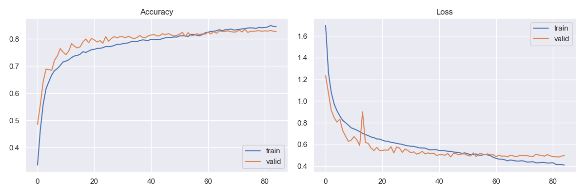

Distributions of Accuracy and Loss values, again on the training and validation datasets:
 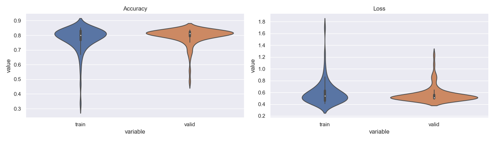

The confusion matrix of predictions produced by our model:
 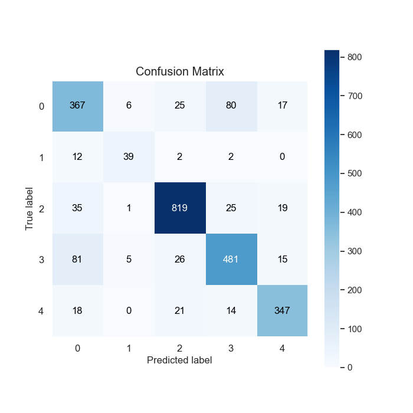

The accuracy table of predicted emotions:

 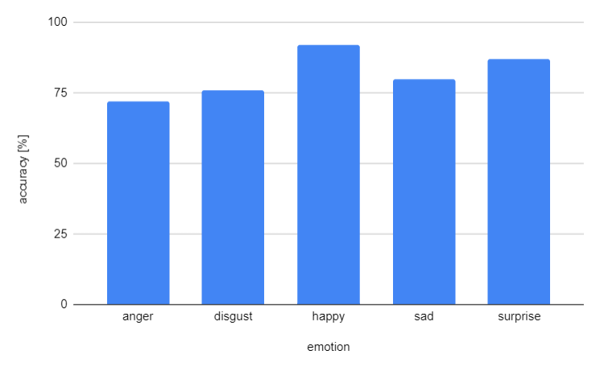

 Where:
   - 0  -> Anger
   - 1  -> Disgust
   - 2  -> Happy
   - 3  -> Sad
   - 4  -> Surprised

Here are some examples of how our model works with webcam:

 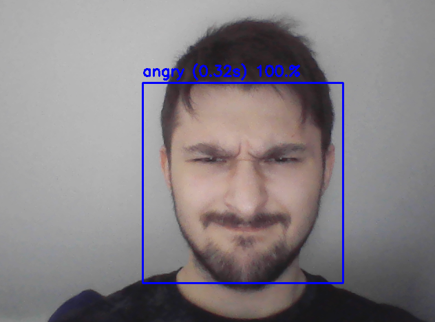
 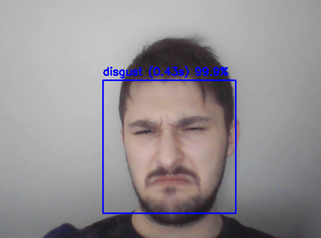
 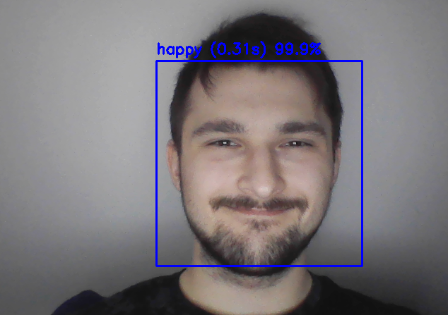
 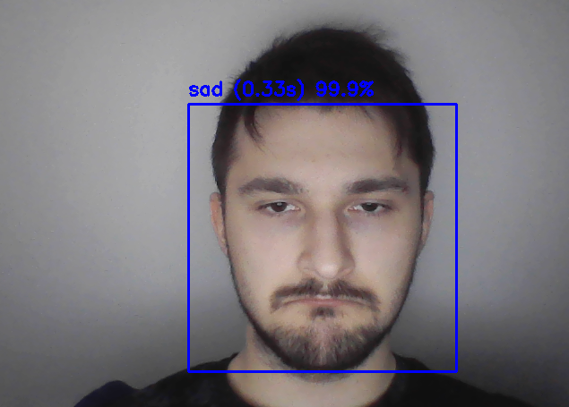
 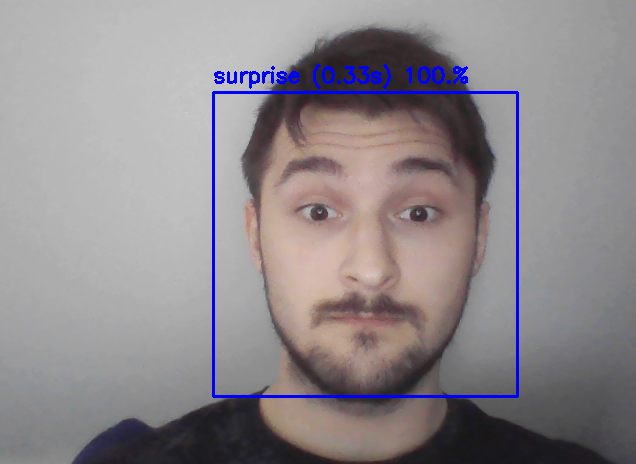

   Given the relative small complexity of the model, and only 5 emotions taken into consideration, these results were satisfactory.

   Next on the agenda is an EfficientNet-like neural net, and a bigger dataset to train it with.

## Evaluation

Metrics for f1 score, recall and precision:

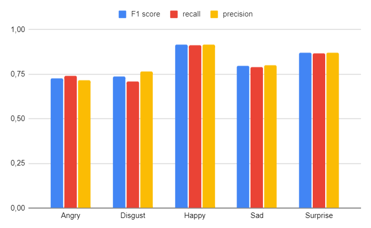

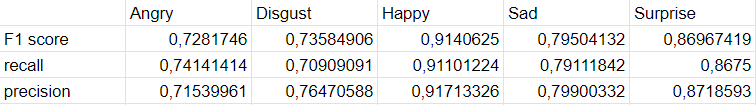

Metrics for True Positive, False Positive and False Positive:

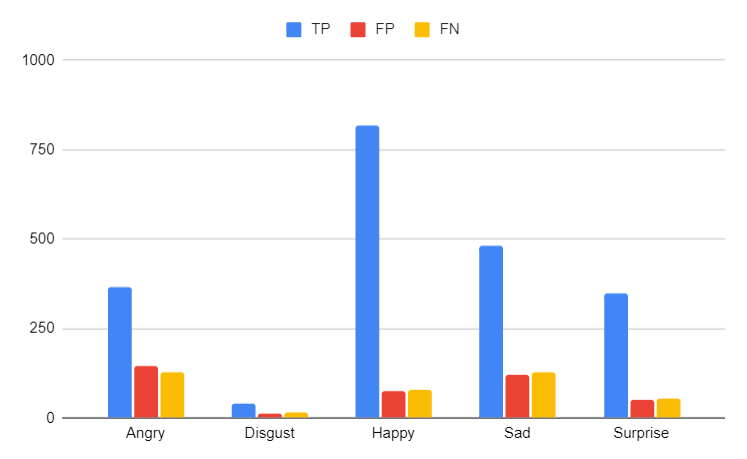

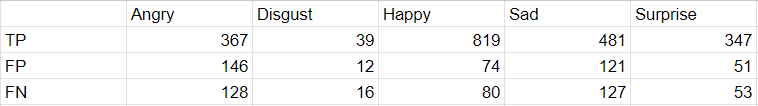

Metrics for Macro avarage and Weighted avarage:

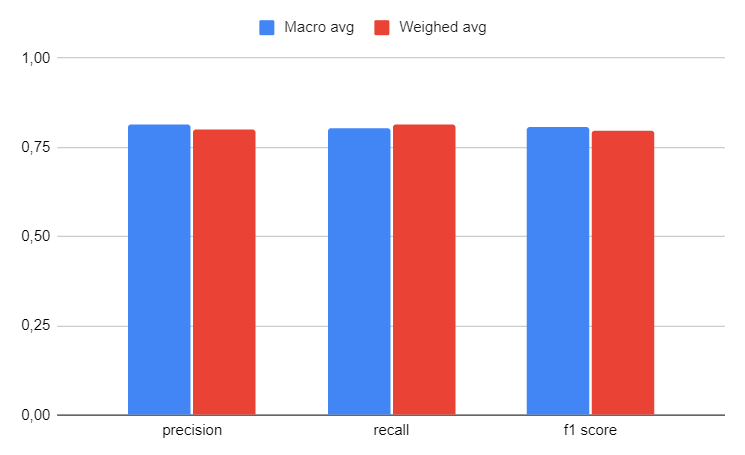

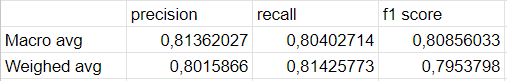

- Micro True Positive: 2053
- Micro False Positive: 404
- Micro False Negative: 404
- Micro precision: 0.8355718355718356
- Micro recall: 0.8355718355718356
- Micro f1 score: 0.8355718355718356
- Micro avarage: [0.83557184 0.83557184 0.83557184]
- Accuracy: 0.8355718355718356