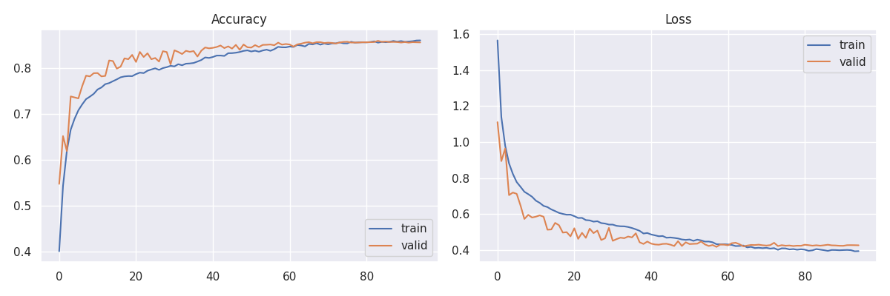

## Second attempt at Facial Emotion Recognition
For our second model, our baseline was a popular, well-acclaimed structure of a Deep Convolutional Neural Network, meaning 2D convolutions layers, followed by batch normalizations, dropouts and maxpooling layers. We trained the model on the  subset of Fer, Ck+ and custom Dataset. 

Emotions taken into consideration in the trainign phase were:
 - Angry
 - Disgust
 - Happy
 - Sad
 - Surprise

Below are the values of Accuracy and Loss, on the training and validation datasets respectively:
 

Distributions of Accuracy and Loss values, again on the training and validation datasets:
 

The confusion matrix of predictions produced by our model:
 

 Where:
   - 0  -> Anger
   - 1  -> Disgust
   - 2  -> Happy
   - 3  -> Sad
   - 4  -> Surprised

   Given the relative small complexity of the model, and only 5 emotions taken into consideration, these results were satisfactory.

   It is a second model that has much better results compared to first model that was created on fer2013 Dataset

## Evaluation

Metrics for f1 score, recall and precision:

Metrics for True Positive, False Positive and False Positive:

Metrics for Macro avarage and Weighted avarage:

- Micro TP: 3195
- Micro FP: 525
- Micro FN: 525
- Micro precision: 0.8588709677419355
- Micro recall: 0.8588709677419355
- Micro f1 score: 0.8588709677419355
- Micro avarage: [0.85887097 0.85887097 0.85887097]
- Accuracy: 0.8588709677419355
