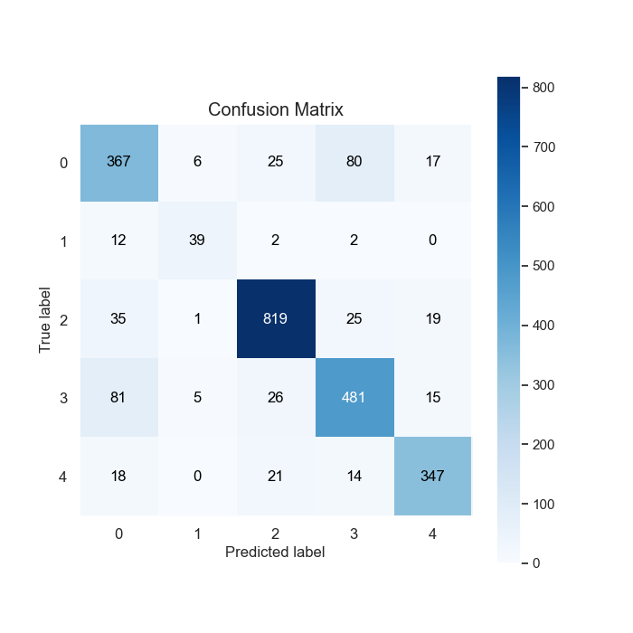

# Review of models

  

## Table of contents

  

- [Review of models](#review-of-models)

- [Table of contents](#table-of-contents)

- [About](#about)

- [Available models for emotion detection](#available-models-for-emotion-detection)

- [FER](#fer)

- [VGG16](#vgg16)

- [AffectNet](#affectnet)

  

# About

Document describing available models of emotion detection

## Available models for emotion detection:
  

### FER

  

Model:

It is created on Convolutional Neural Network (CNN) and it is feeded by batches of 48x48x1 gray-scaled images, which are next stacked along the 4th dimension, as it uses mini-batch gradient descent as optimizer (Adam).

CNN setting we used:

- For generalization purpose dropouts are used at regular intervals.

- ELU is used as the activation function.

- He_normal is used as a kernel initializer.

- Batch min-max normalization is used for better results.

Results:

- First model trained on FER2013 dataset:

Values of Accuracy and Loss, on the training and validation datasets respectively:
 

The confusion matrix of predictions produced by our model:

- Second model trained on FER2013, CK+ and custom dataset:

Values of Accuracy and Loss, on the training and validation datasets respectively:
 

The confusion matrix of predictions produced by our model:
 

### VGG16

Model:

The VGG16 model for facial emotion detection consists of a deep neural network architecture. It starts with a pre-trained base model, which is then followed by several layers to fine-tune the model for emotion recognition.
The model begins with a Dropout layer, which helps in preventing overfitting by randomly dropping out a fraction of the input units. Next, a Flatten layer is added to convert the multi-dimensional output into a 1D vector.
To normalize the inputs and stabilize the learning process, a BatchNormalization layer is included. It standardizes the inputs by adjusting and scaling the activations.
Following that, there are three Dense layers with 32 neurons each, initialized with the 'he_uniform' method. Each Dense layer is followed by a BatchNormalization layer and an Activation layer with the ReLU activation function. 
To further prevent overfitting, Dropout layers with a dropout rate of 0.5 are added after each Dense layer. These layers randomly ignore a fraction of the neurons during training, promoting better generalization.
Finally, the model ends with a Dense layer with 5 neurons, representing the 5 emotions to be detected (happiness, sadness, anger, surprise, disgust). The activation function used in this layer is softmax, which normalizes the output into a probability distribution, indicating the predicted emotion.

Results:

- First model trained on FER2013, CK+ and custom dataset:

Model metric visualisation:
    

## Datasets:

### AffectNet

AffecNet is a facial emotion recognition dataset first published in 2017 that introduced a new scale for emotion recognition. Instead of a categorical model where each emotion is considered as a discrete state, it uses a different scale, namely Valence and Arousal. This dataset however is unavaible at the moment. We tried contacting the original authors of the dataset but were not able to get a response at the time.

### FER2013

The data consists of 48x48 pixel grayscale images of faces. The faces have been automatically registered so that the face is more or less centered and occupies about the same amount of space in each image. The training set consists of 28,709 examples and the public test set consists of 3,589 examples, divided into seven categories:

- Angry

- Disgust

- Fear

- Happy

- Sad

- Surprise

- Neutral

### CK+

Cohn-Kanade Dataset (CK+) that contains 920 individual facial expressions.

Data is already reshaped to 48x48 pixels, in grayscale format and facecropped using haarcascade_frontalface_default.

Noisy (based on room light/hair format/skin colour) images were adapted to be clearly identified using Haar classifier.

Labelled with one of seven expression classes:

 - Anger

 - Contempt 

 - Disgust 

 - Fear 

 - Happiness 

 - Sadness 

 - Surprise. 
 

### RAF

The Real-world Affective Faces Database (RAF-DB) is a dataset for facial expression. It contains 29672 facial images tagged with basic or compound expressions by 40 independent taggers. Images in this database are of great variability in subjects' age, gender and ethnicity, head poses, lighting conditions, occlusions, (e.g. glasses, facial hair or self-occlusion), post-processing operations (e.g. various filters and special effects), etc.