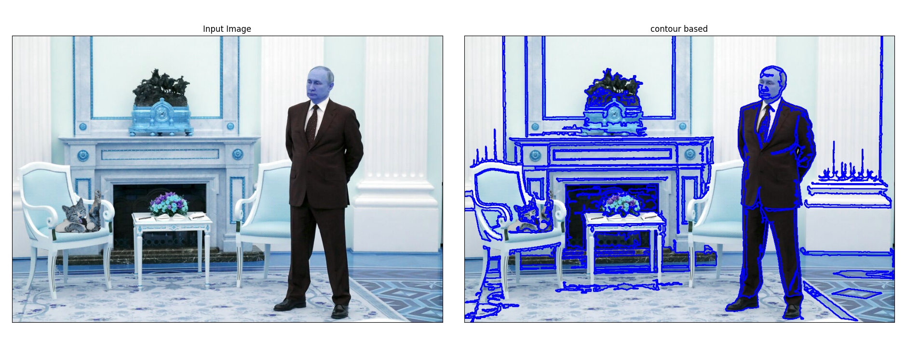
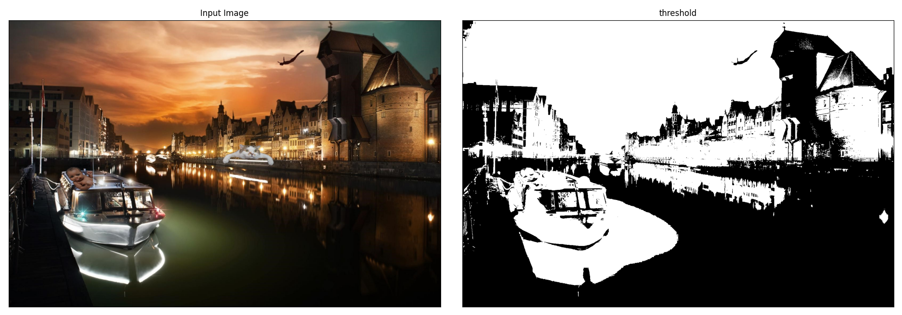
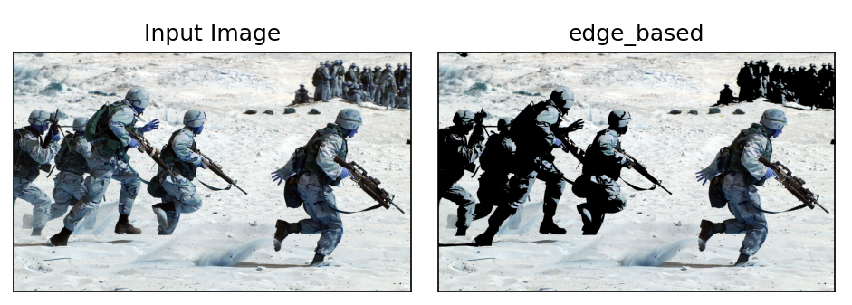
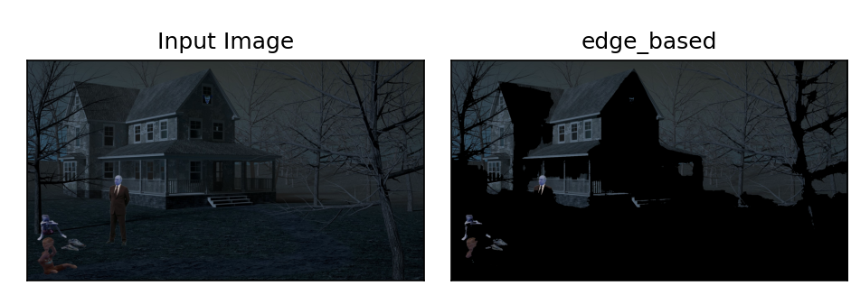
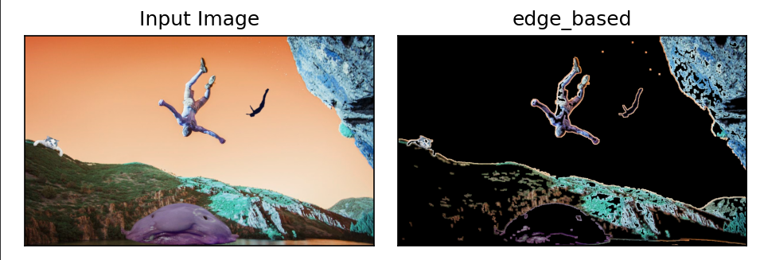
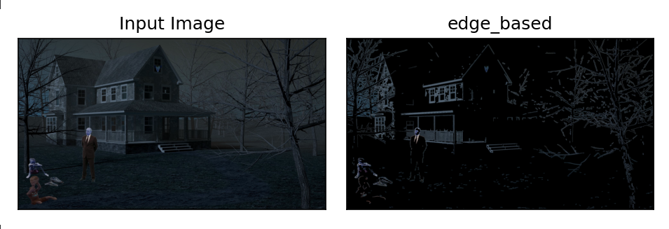

## First attempts at Image Segmentation Methods
Since our main goal on first milestone was to collect a suffecient dataset, our first implementation of segmentation focused on some really basic forms of segmentation such as:
- [Edge segmentation](#edge-segmentation)
- [Contour segmentation](#contour-segmentation)
- [Region based segmentation](#region-based-segmentation)
- [Threshold based segmentation](#region-based-segmentation)

### Contour segmentation

Contour based segmentation method can be a good alternative when the object of interest has well-defined edges or boundaries. 
This method works by detecting the contours or edges of the object based on differences in intensity or color between the object and the background. 
It can handle images with uneven lighting and low contrast.
But in our case contour based segmentation method is not the best in our case. It detects too many countours, we are not interested in. 

### Treshold based segmentation

Treshold based segmentation method can be a good option when the image has a clear contrast between the object of interest and the background. 
In our case, it is really hard to chose well threshold value that can effectively segment the object from the background.
This method is not be the best choice when the image has uneven lighting, low contrast, or the object of interest is connected to the background. 
Due to this reason, we cannot use this method as it does not meet our expectations.

### Region based segmentation

We can see that this segmentation isn't taking all important elements into consideration

With our images the segmentation becomes worse and distinguish little to none of our intended parts

Region based segmentation method is an effective approach when the object of interest is composed of regions with similar properties such as color, texture, or intensity. 
This method works by grouping pixels or regions that share similar characteristics, and separating them from the background.
In our case, region based segmentation may be a good option as the object of interest has distinct regions with different properties.
It is not enough for our project, because it is not taking all important elements into consideration and is really bad for our images. 

### Edge segmentation

Edge base segmantation distinguished all interesting points on our created image

With darker image it didn't do as well as with brighter image, but still managed to segment all of our points of our created image

Edge segmentation method is a widely used approach for segmenting objects in images, especially when the object of interest has well-defined edges or boundaries. 
This method works by detecting the edges of the object based on differences in intensity or color between the object and the background.
In edge segmentation, the image is filtered to enhance the edges, and then a threshold or edge detection algorithm is applied to extract the edges. 
The resulting edges are then used to separate the object from the background.
In our case, edge segmentation is the best option of all those mentioned earlier as it is detecting the edges of the objects really good.